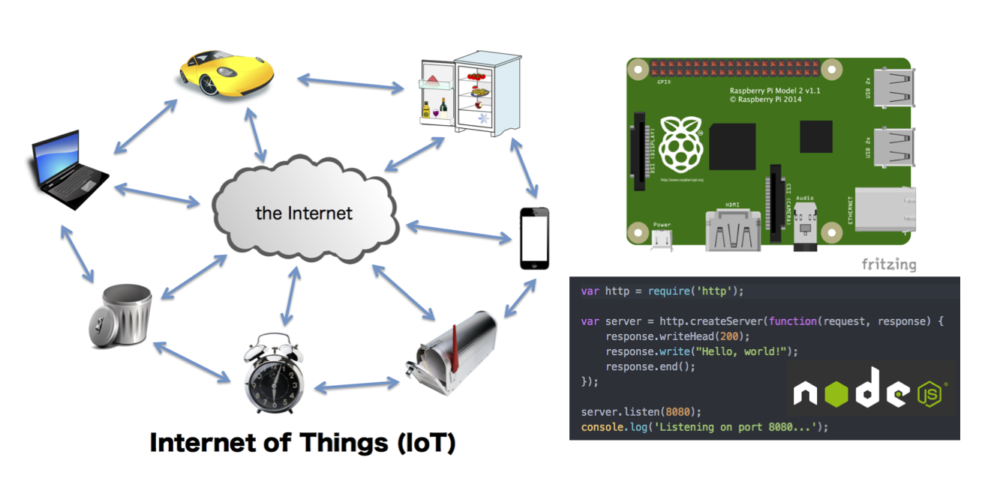

Last updated on September 20th

# Title of class
** Short introduction to a web server application development for Internet of Things  
\- Let's build a web application running on a micro-computer with Japanese students! \- **

# Abstract
Internet of Things (IoT) is the upcoming generation of networks, in which everything is connected to the others via the Internet. Not only PCs, tablets, and smartphones, but also automobiles, refrigerators, and even dust-boxes can communicate with each other in the IoT. Nowadays, a lot of novel applications and services are emerging in the IoT.

This class offers you hands-on exercises on building a system working in the IoT. The system is a small web server with some sensors for recording environmental data around it. To build the web server in this class, you use Raspberry Pi as a micro-computer and Node.js as a platform for web application development. Node.js makes it possible for you to make a server-side application in JavaScript easily. In this class, you will learn how to implement a web application on a micro-controller with some sensors "with Japanese students."

# Keywords
Node.js, JavaScript, Raspberry Pi, IoT, HTML, WebSocket, JSON, Sensors

# Preresuisite for this class
basic skill in programming

# Schedule at a glance
* Day 1 (Sep 21st 16:00-18:00): Node.js Workshop Part 1
    1. Internet of Things
    1. Raspberry Pi
    1. HTML &amp; JavaScript
    1. 'Hello, world!' in Node.js
    1. Build a web server with Node.js
* Day 2 (Sep 22nd 16:00-18:00): Node.js Workshop Part 2
    1. Data format and communication protocol (JSON and WebSocket)
    1. Build WebSocket server and client with Node.js
    1. So what is Node.js?
    1. Build a web application providing environmental data via the Internet
* Day 3 (Sep 23rd 16:00-18:00): Discussion and Presentations
    1. Discussion and preparation for presentation
    2. Presentations

Minor change would be possible.

# Outcomes
* The ability to make a simple web application with Node.js
* The ability to use a micro-computer and sensors to measure environmental data*

# References
* Raspberry Pi: https://www.raspberrypi.org/
* Node.js: https://nodejs.org/
* Why Node.js Is Totally Awesome: http://chetansurpur.com/blog/2010/10/why-node-js-is-totally-awesome.html
* WebSocket: https://www.websocket.org/
* JSON (JavaScript Object Notation): http://json.org/
* IoT Disruptions: The Internet of Things - Innovations &amp; Jobs ([amazon](http://www.amazon.com/IoT-Disruptions-Internet-Things-Innovations-ebook/dp/B00Y0CPV5I))

# Lecturer
Jun Kobayashi, Ph.D  
Associate Professor  
Kyushu Institute of Technology  
jkoba@ces.kyutech.ac.jp  
